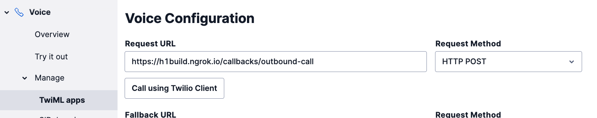
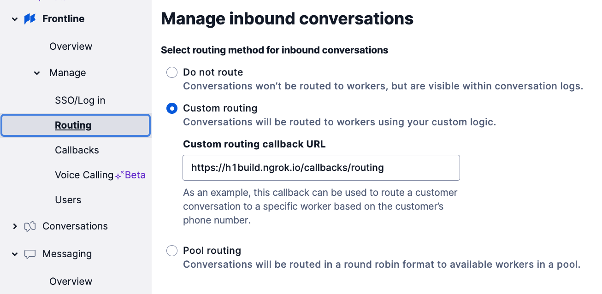

# Frontline Voice and Intelligence Integration Service Example

This repo is built on top of the [Frontline Integration Service](https://github.com/twilio/frontline-demo-service) referenced in the [Twilio Frontline Quickstart](https://www.twilio.com/docs/frontline/nodejs-demo-quickstart).

The following callbacks were added to enable Frontline Voice and Intelligence
- `conversations-action.js`, this callback is called after an inbound or outbound call. You can utilize more Programmable Voice if necessary, eg. IVR.
- `inbound-call.js`, this callback is called when an inbound call is made to your Twilio number. Imagine a customer is attempting to reach a Sales Agent.
- `outbound-call.js`, this callback is called when an outbound call is initiated by your Sales Agent from the Frontline Mobile App.
- `recordings.js`, this callback handles the Conversation noun's attribute `recordingStatusCallback`. It makes an HTTP request to the Twilio Intelligence endpoint to create a Transcript. Not recommended for production.

Also, line 18 in create-app.js was changed to `app.use(express.urlencoded({extended: true}));`.

## Prerequisites
- A Twilio Account. Don't have one? [Sign up](https://www.twilio.com/try-twilio) for free!
- Follow the quickstart tutorial [here](https://www.twilio.com/docs/frontline/nodejs-demo-quickstart).
- Follow the Frontline Integration Service Example. Please refer to this [README](https://github.com/twilio/frontline-demo-service#readme) for Frontline Integration Service set up.
- Enable Voice Integration [here](https://www.twilio.com/docs/frontline/voice-integration).

## Environment variables

```
# Service variables
PORT # default 5000

# Twilio account variables
TWILIO_ACCOUNT_SID=ACXXX
TWILIO_AUTH_TOKEN=XXX


# Variables for chat configuration
TWILIO_SMS_NUMBER # Twilio number for incoming/outgoing SMS
TWILIO_WHATSAPP_NUMBER # Twilio number for incoming/outgoing Whatsapp

# Variables for Intelligence Services
TWILIO_CONVERSATION_SERVICE_INSTANCE_SID=ISXXX
TWILIO_INTELLIGENCE_SERVICE_SID=GAXXX
TWILIO_BASIC_AUTH=XXX

```

## Setting up your Frontline Voice Settings

To enable outbound voice calls, you will need to add an external Request URL within Voice in Frontline Voice Configurations.

Twilio Console > Voice > Manage > TwiML Apps > Request URL > `path/to/callbacks/outbound-call`



### (Optional)
If you want Custom Routing, add your project's routing callback to Frontline's routing config.

Console > Frontline > Manage > Routing > `path/to/callbacks/routing`




## Setting up customers and mapping
The customer data can be configured in ```src/routes/callbacks/crm.js```.

Quick definition of customer's objects can be found below.

### Map between customer address + worker identity pair.
```js
{
    customerAddress: workerIdentity
}
```

Example:
```js
const customersToWorkersMap = {
    'whatsapp:+87654321': 'john@example.com'
}
```

### Customers list
Example:
```js
const customers = [
    {
        customer_id: 98,
        display_name: 'Bobby Shaftoe',
        channels: [
            { type: 'email', value: 'bobby@example.com' },
            { type: 'sms', value: '+123456789' },
            { type: 'whatsapp', value: 'whatsapp:+123456789' }
        ],
        links: [
            { type: 'Facebook', value: 'https://facebook.com', display_name: 'Social Media Profile' }
        ],
        worker: 'joe@example.com'
    }
];
```

---
Detailed information can be found in **Quickstart**, provided by Frontline team.
